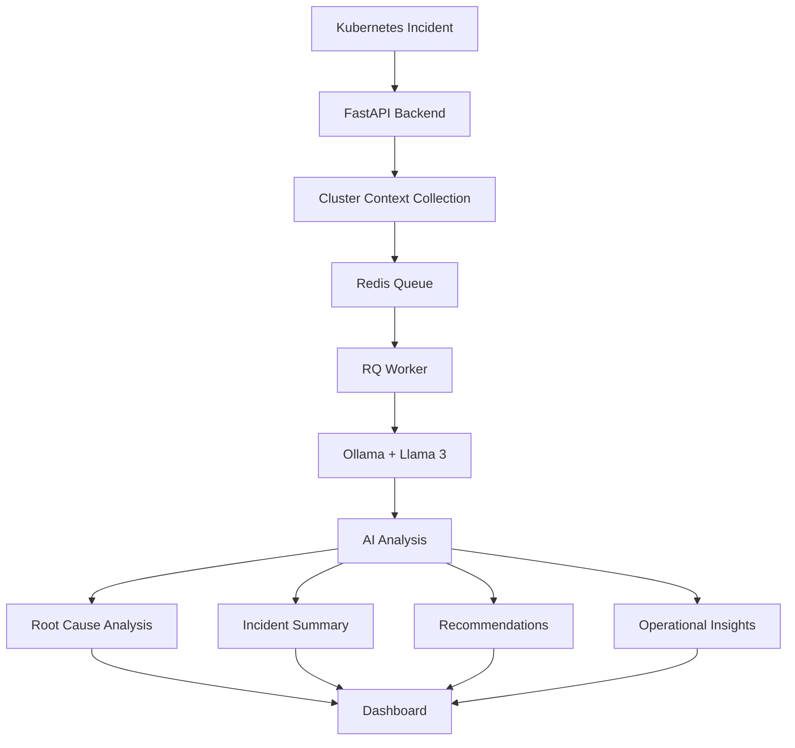
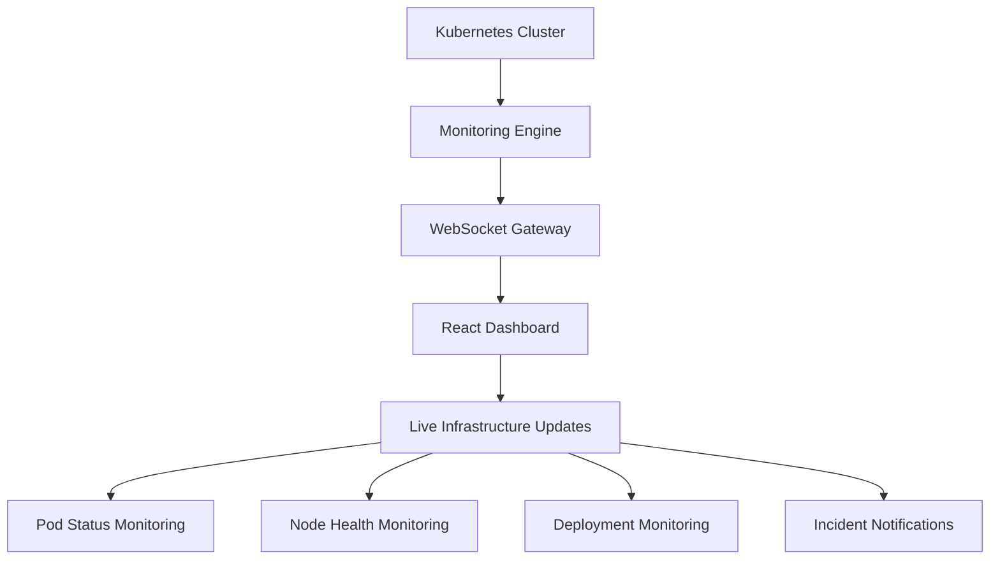
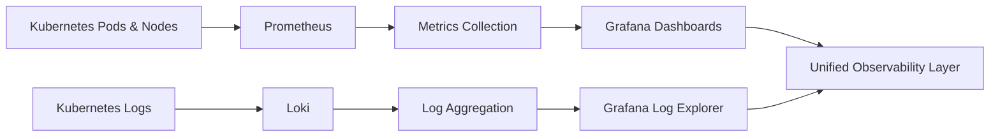
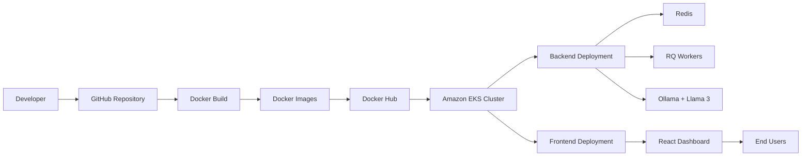
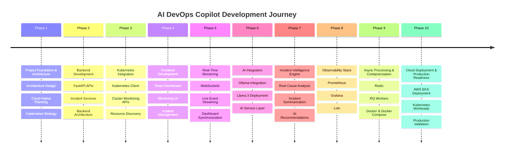

# AI-DevOps-Copilot
.

🚀 AI DevOps Copilot
### AI-Powered Kubernetes Incident Intelligence & Observability Platform

AI DevOps Copilot is a cloud-native AIOps platform designed to enhance Kubernetes operations through real-time monitoring, intelligent incident analysis, and AI-assisted troubleshooting.

The platform combines Kubernetes observability, live infrastructure monitoring, asynchronous incident processing, AI-powered root cause analysis, and cloud-native deployment practices into a unified operational dashboard.

Unlike traditional monitoring solutions that only surface metrics and logs, AI DevOps Copilot leverages Ollama and Llama 3 to transform Kubernetes telemetry into actionable operational intelligence, enabling DevOps engineers to detect issues faster, understand incidents more effectively, and accelerate remediation workflows.

🎯 Project Overview

Modern Kubernetes environments generate a continuous stream of:

Cluster Events
Pod Status Changes
Infrastructure Metrics
Application Logs
Resource Utilization Data
Operational Alerts

Analyzing and correlating this information manually is both time-consuming and error-prone.

AI DevOps Copilot addresses this challenge by combining:

Kubernetes Monitoring
AI-Powered Incident Intelligence
Real-Time Event Streaming
Observability Engineering
Cloud-Native Deployment

to create an intelligent operational assistant for DevOps teams.

✨ Key Features
🤖 AI-Powered Incident Intelligence

Powered by:

Ollama
Llama 3

Capabilities:

Root Cause Analysis
Incident Summarization
Intelligent Recommendations
Infrastructure Insights
Context-Aware Troubleshooting
☸ Kubernetes Monitoring

Monitor Kubernetes resources in real time:

Pods
Nodes
Deployments
Services
Namespaces
ReplicaSets
Events

Provides continuous visibility into cluster health and workload status.

📡 Real-Time WebSocket Monitoring

Implemented a WebSocket-based communication layer to provide:

Live Incident Updates
Real-Time Cluster Events
Instant Dashboard Synchronization
Continuous Infrastructure Visibility

This enables engineers to observe operational changes as they happen.

⚡ Asynchronous Incident Processing

Built using:

Redis
RQ (Redis Queue)

Responsibilities:

Background Incident Processing
AI Analysis Requests
Event Queue Management
Scalable Workload Distribution

Benefits:

Improved Performance
Reduced API Latency
Faster Dashboard Response Times
Better Scalability
📊 Observability Platform
Prometheus

Collects:

Cluster Metrics
Node Metrics
Pod Metrics
Resource Utilization Metrics
Application Health Metrics
Grafana

Provides:

Infrastructure Dashboards
Resource Monitoring
Cluster Health Visualization
Incident Analytics
Loki

Provides centralized log aggregation:

Kubernetes Logs
Application Logs
Pod-Level Visibility
Operational Troubleshooting

Together, Prometheus, Grafana, and Loki provide a complete observability stack.

🐳 Containerized Architecture

All platform services are containerized using Docker.

Containers:

Frontend Service
Backend Service
Ollama Service
Redis Service
RQ Worker Services

Benefits:

Portability
Consistency
Scalability
Simplified Deployment

☁️ AWS EKS Deployment

The platform is deployed using Amazon Elastic Kubernetes Service (EKS).

Infrastructure Components:

Amazon EKS
Amazon VPC
Security Groups
IAM Roles
Application Load Balancer
Kubernetes Worker Nodes

This deployment architecture follows cloud-native best practices for scalability and reliability.

.

🏗️ System Architecture

Insert Architecture Diagram Here


🧠 AI Incident Analysis Workflow
## 🧠 AI Incident Analysis Workflow


📡 Real-Time Monitoring Workflow
## 📡 Real-Time Monitoring Workflow


🔍 Observability Workflow
## 🔍 Observability Workflow


🏛️ Technology Stack
Frontend
React.js
Vite
Tailwind CSS
Axios
WebSockets
Backend
FastAPI
Python
Uvicorn
AI & Intelligence
Ollama
Llama 3
Async Processing
Redis
Redis Queue (RQ)
Background Workers
Monitoring & Observability
Prometheus
Grafana
Loki
Containerization
Docker
Docker Compose
Orchestration
Kubernetes
Amazon EKS
Cloud Platform
AWS
VPC
IAM
Application Load Balancer
Version Control
Git
GitHub
📂 Project Structure
## 📂 Project Structure

```text
AI-DevOps-Copilot
│
├── backend/
│   ├── app/
│   ├── services/
│   ├── routes/
│   ├── models/
│   ├── worker.py
│   ├── requirements.txt
│   └── Dockerfile
│
├── frontend/
│   ├── src/
│   ├── public/
│   ├── package.json
│   └── Dockerfile
│
├── kubernetes/
│   ├── deployments/
│   │   ├── backend-deployment.yaml
│   │   └── frontend-deployment.yaml
│   │
│   ├── services/
│   │   ├── backend-service.yaml
│   │   └── frontend-service.yaml
│   │
│   ├── monitoring/
│   │   ├── prometheus.yaml
│   │   └── grafana.yaml
│   │
│   └── ingress.yaml
│
├── monitoring/
│   ├── prometheus/
│   ├── grafana/
│   └── loki/
│
├── terraform/
│
├── docs/
│
├── images/
│   ├── architecture-diagram.png
│   ├── dashboard.png
│   ├── grafana-dashboard.png
│   └── eks-deployment.png
│
├── docker-compose.yml
├── README.md
└── .github/
```└── README.md


## 🚀 Deployment Pipeline



# 🏆 Project Development Roadmap



🎓 Skills Demonstrated
Kubernetes Administration
Amazon EKS
Docker
FastAPI
React
WebSockets
Redis
RQ Workers
Prometheus
Grafana
Loki
Observability Engineering
Cloud-Native Architecture
AIOps
LLM Integration
Ollama
Llama 3
Incident Management
Infrastructure Monitoring
DevOps Practices
Deployment
🎓 Skills Demonstrated

Instead of a giant paragraph:

# 🎓 Skills Demonstrated

### Cloud & DevOps

- AWS
- Amazon EKS
- Docker
- Kubernetes
- kubectl
- eksctl

### Backend Engineering

- FastAPI
- Python
- REST APIs
- WebSockets

### Frontend Development

- React
- Vite
- Tailwind CSS

### AI & LLM Engineering

- Ollama
- Llama 3
- Prompt Engineering
- AI Incident Analysis

### Monitoring & Observability

- Prometheus
- Grafana
- Loki

### Distributed Systems

- Redis
- RQ Workers
- Asynchronous Processing

### Platform Engineering

- Incident Management
- Infrastructure Monitoring
- Root Cause Analysis
- Observability Engineering
🔮 Future Enhancements
# 🔮 Future Enhancements

- CI/CD using GitHub Actions
- Automated Incident Remediation
- Multi-Cluster Kubernetes Monitoring
- Slack Integration
- Microsoft Teams Integration
- Alertmanager Integration
- Predictive Incident Detection
- AI Agent Workflows
- RBAC & Multi-Tenant Support
👩‍💻 Author
# 👩‍💻 Author

**Iram Khan**

B.Tech – Computer Science & Engineering  
Specialization: Cloud Computing & Automation  
VIT Bhopal University

### Connect With Me

- GitHub: https://github.com/iramk596
- LinkedIn: YOUR_LINKEDIN_URL

---
⭐ Support
# ⭐ Support

If you found this project useful:

- ⭐ Star the repository
- 🍴 Fork the project
- 📢 Share it with your network

Your support helps improve and expand the platform.
